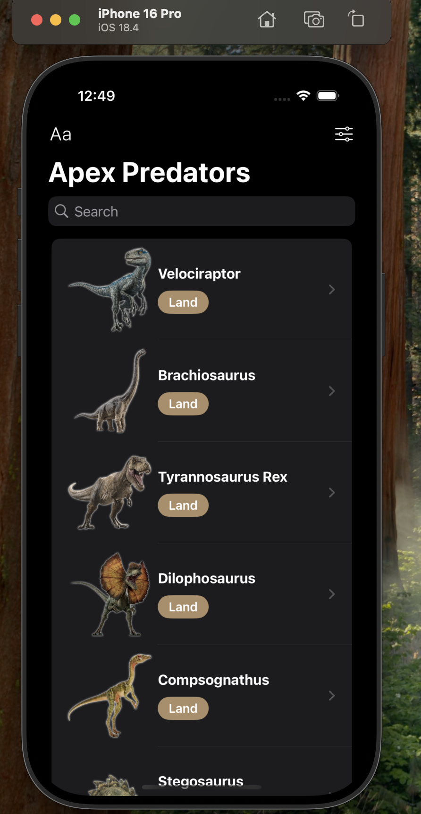
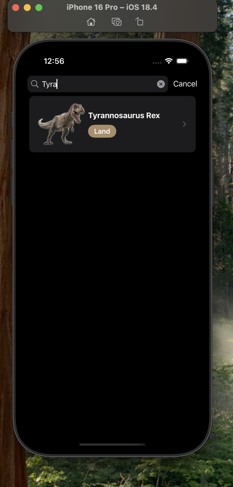
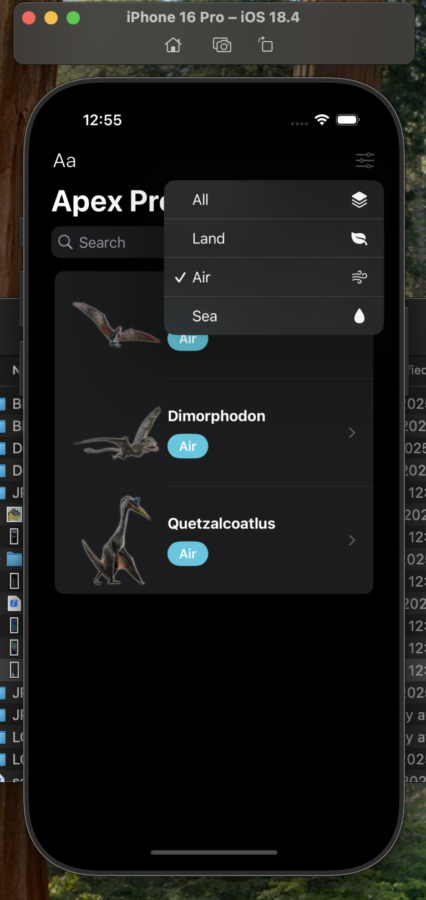
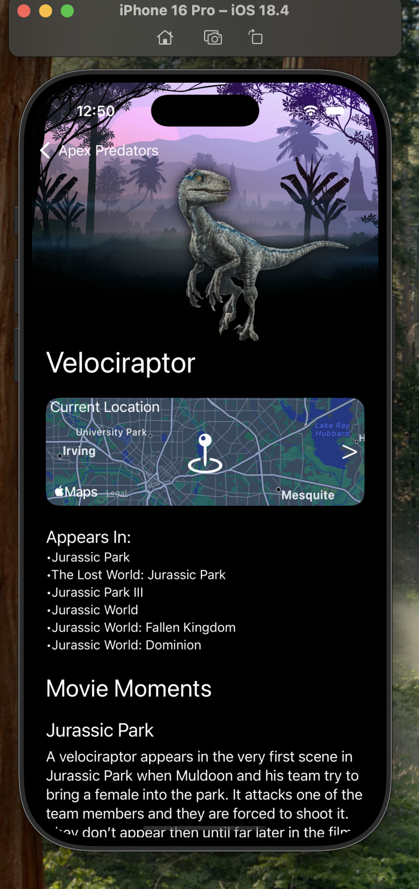
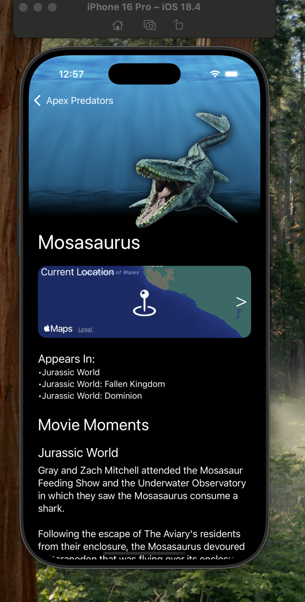
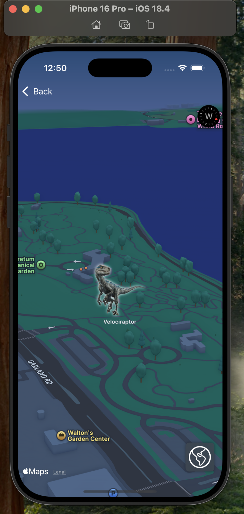
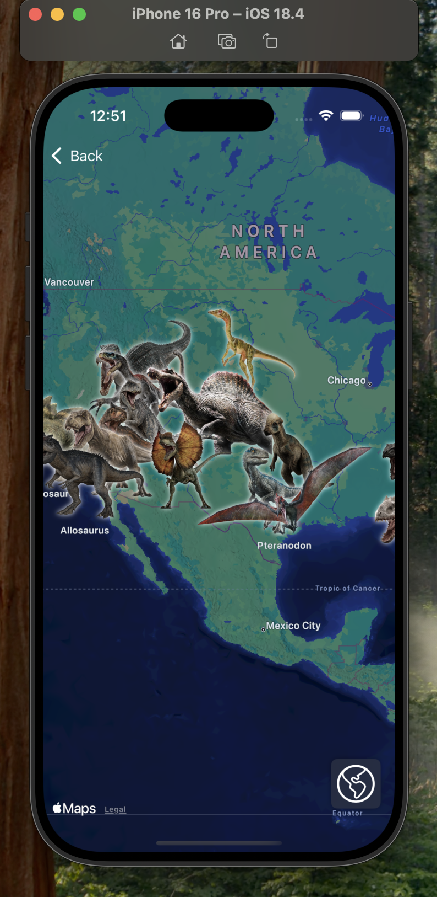
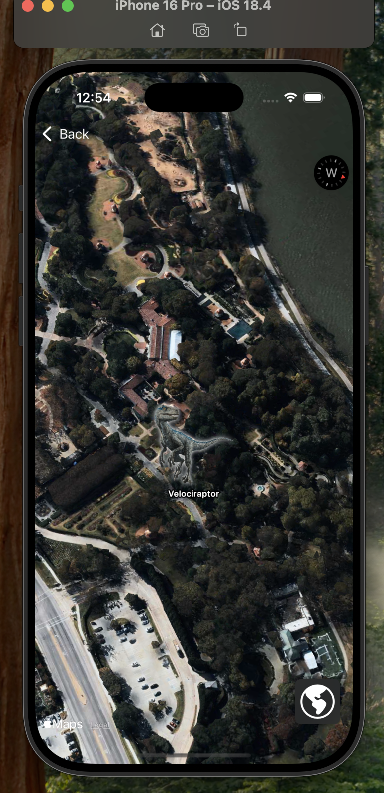

# 🦖 JPApexPredators

**JPApexPredators** is a SwiftUI app that showcases apex predators from the Jurassic Park universe. The app features a searchable and filterable list, detailed movie appearances, interactive maps, and a bonus iMessage sticker pack.

---

## ✨ Features

- 📄 List of predators with images, type badges, and sorting options
- 🔍 Real-time **search**, **sort**, and **filter** by species type
- 🗺️ **MapKit integration** with annotations for predator locations
- 🧭 Satellite/Standard map toggle with live updates
- 🎬 View predator movie appearances and detailed scene descriptions
- 🦕 Includes a custom **iMessage Sticker Pack** using dinosaur art
- 🎨 Dark-mode friendly design using SwiftUI
- 📱 Fully built in SwiftUI and optimized for iOS

---

## 🛠 Technologies Used

- Swift 6
- SwiftUI
- MapKit
- Codable / JSON decoding
- SF Symbols
- Custom asset catalogs
- Sticker Pack Extension for iMessage
- UIKit-free, SwiftUI-native UI architecture

---

## 🧭 How to Run

1. Clone the repository:
   ```bash
   git clone https://github.com/Collin-Schmitt/JPApexPredators.git
2. Open the project in Xcode 15 or later
3. Run the app on a simulator or IOS device (IOS 17+ recommended)

---
## 📁 Project Structure

- ContentView.swift – Main list UI with search, filter, and navigation
- PredatorDetail.swift – Detailed predator view including movie scenes
- PredatorMap.swift – Full-screen MapKit view of predator locations
- Predators.swift – Data decoding, filtering, and sorting logic
- ApexPredator.swift – Model struct conforming to Identifiable and Codable
- Sticker Pack Extension – iMessage stickers using dinosaur assets
- jpapexpredators.json – Local JSON with predator data and scene info

---

## 📸 Screenshots

<h4>Home Page - List of Predators</h4>


<h4>Search Feature</h4>


<h4>Filter Menu</h4>


<h4>Dinosaur Detail View (Part 1)</h4>


<h4>Dinosaur View (Part 2)</h4>


<h4>Map View - Single Location</h4>


<h4>Map View - Zoomed Out</h4>


<h4>Satellite Map View</h4>


---

## 🙌 Acknowledgments

- Inspired by the Jurassic Park and Jurassic World film franchises

- Built as a SwiftUI learning project exploring:

   - SwiftUI best practices

   - MapKit integration

   - List animations and search

   - Clean data architecture

   - iMessage sticker creation
